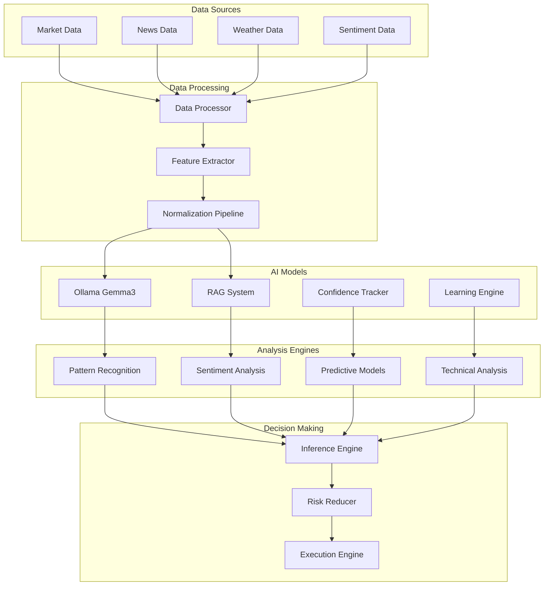

# NIRAJ AI/ML Documentation

## Overview

The NIRAJ trading system integrates advanced AI/ML capabilities to enhance trading decisions through pattern recognition, market sentiment analysis, and predictive modeling. This document provides comprehensive information about the AI architecture, model training, inference pipeline, and configuration options.

## Table of Contents

1. [AI Architecture Overview](#ai-architecture-overview)
2. [Ollama Integration](#ollama-integration)
3. [RAG System](#rag-system)
4. [Confidence Tracking](#confidence-tracking)
5. [Learning Engine](#learning-engine)
6. [Pattern Recognition](#pattern-recognition)
7. [Market Sentiment Analysis](#market-sentiment-analysis)
8. [Predictive Models](#predictive-models)
9. [Model Training Pipeline](#model-training-pipeline)
10. [Inference Engine](#inference-engine)
11. [Performance Monitoring](#performance-monitoring)
12. [Configuration](#configuration)
13. [Troubleshooting](#troubleshooting)

---

## AI Architecture Overview

### System Components



### Core AI Components

#### 1. Large Language Model (LLM)
- **Model**: Ollama Gemma3:4b-it-q4_K_M
- **Purpose**: Natural language understanding, pattern analysis, decision reasoning
- **Capabilities**: Market analysis, news interpretation, strategy explanation

#### 2. Retrieval-Augmented Generation (RAG)
- **Purpose**: Context-aware information retrieval and generation
- **Data Sources**: Historical market data, news archives, trading patterns
- **Applications**: Market context analysis, similar pattern identification

#### 3. Confidence Tracking System
- **Purpose**: Track prediction accuracy and model confidence
- **Metrics**: Prediction accuracy, confidence scores, uncertainty quantification
- **Applications**: Risk adjustment, model selection, performance optimization

#### 4. Learning Engine
- **Purpose**: Continuous learning from trading outcomes
- **Techniques**: Online learning, reinforcement learning, adaptive algorithms
- **Applications**: Strategy optimization, parameter tuning, performance improvement

---

## Ollama Integration

### Setup and Configuration

#### Installation
```bash
# Install Ollama
curl -fsSL https://ollama.ai/install.sh | sh

# Start Ollama service
ollama serve

# Pull the required model
ollama pull gemma3:4b-it-q4_K_M
```

#### Configuration
```python
# src/ai/gemma3_integration.py
import asyncio
import json
import aiohttp
from typing import Dict, List, Optional, Any
from pydantic import BaseModel
from src.core.config import config
from src.utils.logger import get_logger

logger = get_logger(__name__)

class GemmaRequest(BaseModel):
    model: str = "gemma3:4b-it-q4_K_M"
    prompt: str
    stream: bool = False
    options: Dict[str, Any] = {
        "temperature": 0.7,
        "top_p": 0.9,
        "top_k": 40,
        "repeat_penalty": 1.1,
        "num_ctx": 4096
    }

class GemmaResponse(BaseModel):
    response: str
    done: bool
    total_duration: Optional[int] = None
    load_duration: Optional[int] = None
    prompt_eval_count: Optional[int] = None
    prompt_eval_duration: Optional[int] = None
    eval_count: Optional[int] = None
    eval_duration: Optional[int] = None

class OllamaClient:
    def __init__(self, base_url: str = "http://localhost:11434"):
        self.base_url = base_url
        self.session = None

    async def __aenter__(self):
        self.session = aiohttp.ClientSession(
            timeout=aiohttp.ClientTimeout(total=120)
        )
        return self

    async def __aexit__(self, exc_type, exc_val, exc_tb):
        if self.session:
            await self.session.close()

    async def generate(self, request: GemmaRequest) -> GemmaResponse:
        """Generate response from Ollama model"""
        try:
            url = f"{self.base_url}/api/generate"

            async with self.session.post(url, json=request.dict()) as response:
                if response.status != 200:
                    error_text = await response.text()
                    raise Exception(f"Ollama API error: {response.status} - {error_text}")

                result = await response.json()
                return GemmaResponse(**result)

        except Exception as e:
            logger.error(f"Error calling Ollama: {e}")
            raise

    async def analyze_market_pattern(
        self,
        market_data: Dict[str, Any],
        context: Optional[str] = None
    ) -> Dict[str, Any]:
        """Analyze market patterns using AI"""

        prompt = self._create_market_analysis_prompt(market_data, context)

        request = GemmaRequest(
            prompt=prompt,
            options={
                "temperature": 0.3,  # Lower temperature for analysis
                "top_p": 0.8,
                "num_ctx": 8192
            }
        )

        response = await self.generate(request)

        # Parse structured response
        try:
            analysis = json.loads(response.response)
            return {
                "pattern_identified": analysis.get("pattern", "unknown"),
                "confidence": analysis.get("confidence", 0.5),
                "trend_direction": analysis.get("trend", "neutral"),
                "risk_level": analysis.get("risk", "medium"),
                "reasoning": analysis.get("reasoning", ""),
                "recommended_action": analysis.get("action", "hold")
            }
        except json.JSONDecodeError:
            # Fallback to text analysis
            return {
                "pattern_identified": "complex",
                "confidence": 0.6,
                "analysis_text": response.response,
                "recommended_action": "analyze_further"
            }

    def _create_market_analysis_prompt(
        self,
        market_data: Dict[str, Any],
        context: Optional[str] = None
    ) -> str:
        """Create structured prompt for market analysis"""

        base_prompt = f"""
You are an expert financial analyst specializing in options trading and market pattern recognition.

Analyze the following Bank Nifty market data:

Market Data:
- Current Price: {market_data.get('price', 'N/A')}
- Volume: {market_data.get('volume', 'N/A')}
- High: {market_data.get('high', 'N/A')}
- Low: {market_data.get('low', 'N/A')}
- Open: {market_data.get('open', 'N/A')}
- Previous Close: {market_data.get('prev_close', 'N/A')}
- Technical Indicators: {json.dumps(market_data.get('indicators', {}), indent=2)}

{f"Additional Context: {context}" if context else ""}

Please provide your analysis in the following JSON format:
{{
    "pattern": "pattern_name",
    "confidence": 0.0-1.0,
    "trend": "bullish|bearish|neutral",
    "risk": "low|medium|high",
    "reasoning": "detailed explanation",
    "action": "buy|sell|hold|wait"
}}

Focus on:
1. Chart patterns and technical indicators
2. Volume analysis and market sentiment
3. Risk assessment for options trading
4. Entry/exit timing recommendations
"""
        return base_prompt

    async def explain_strategy_decision(
        self,
        strategy_name: str,
        parameters: Dict[str, Any],
        market_conditions: Dict[str, Any]
    ) -> str:
        """Generate human-readable explanation for strategy decisions"""

        prompt = f"""
Explain the following trading strategy decision in simple terms:

Strategy: {strategy_name}
Parameters: {json.dumps(parameters, indent=2)}
Market Conditions: {json.dumps(market_conditions, indent=2)}

Provide a clear, concise explanation that covers:
1. Why this strategy was selected
2. What market conditions triggered it
3. Expected outcomes and risks
4. Exit criteria

Use professional but accessible language suitable for traders.
"""

        request = GemmaRequest(
            prompt=prompt,
            options={"temperature": 0.5, "top_p": 0.9}
        )

        response = await self.generate(request)
        return response.response
```

### Advanced Usage Patterns

#### Streaming Responses
```python
async def stream_market_analysis(self, market_data: Dict[str, Any]):
    """Stream real-time analysis updates"""

    request = GemmaRequest(
        prompt=self._create_streaming_prompt(market_data),
        stream=True
    )

    url = f"{self.base_url}/api/generate"

    async with self.session.post(url, json=request.dict()) as response:
        async for line in response.content:
            if line:
                try:
                    chunk = json.loads(line.decode('utf-8'))
                    if not chunk.get('done', False):
                        yield chunk.get('response', '')
                    else:
                        break
                except json.JSONDecodeError:
                    continue
```

---

## RAG System

### Architecture

```python
# src/ai/rag_processor.py
import numpy as np
import pandas as pd
from typing import List, Dict, Any, Optional
from sentence_transformers import SentenceTransformer
import faiss
from datetime import datetime, timedelta
from src.core.database_manager import DatabaseManager
from src.utils.logger import get_logger

logger = get_logger(__name__)

class RAGProcessor:
    def __init__(self, embedding_model: str = "all-MiniLM-L6-v2"):
        self.embedding_model = SentenceTransformer(embedding_model)
        self.index = None
        self.documents = []
        self.metadata = []

    async def initialize(self, db: DatabaseManager):
        """Initialize RAG system with historical data"""
        await self.load_market_patterns(db)
        await self.load_news_context(db)
        await self.load_strategy_outcomes(db)
        await self.build_index()

    async def load_market_patterns(self, db: DatabaseManager):
        """Load historical market patterns"""
        try:
            # Get historical market data with patterns
            query = """
            SELECT
                date,
                symbol,
                pattern_type,
                pattern_description,
                outcome,
                confidence_score,
                market_conditions
            FROM historical_patterns
            WHERE date >= %s
            ORDER BY date DESC
            """

            cutoff_date = datetime.now() - timedelta(days=365)
            patterns = await db.execute_query(query, (cutoff_date,))

            for pattern in patterns:
                document = f"""
Market Pattern: {pattern['pattern_type']}
Date: {pattern['date']}
Symbol: {pattern['symbol']}
Description: {pattern['pattern_description']}
Market Conditions: {pattern['market_conditions']}
Outcome: {pattern['outcome']}
Confidence: {pattern['confidence_score']}
"""

                self.documents.append(document)
                self.metadata.append({
                    'type': 'market_pattern',
                    'date': pattern['date'],
                    'symbol': pattern['symbol'],
                    'pattern_type': pattern['pattern_type'],
                    'outcome': pattern['outcome']
                })

        except Exception as e:
            logger.error(f"Error loading market patterns: {e}")

    async def load_news_context(self, db: DatabaseManager):
        """Load relevant news context"""
        try:
            query = """
            SELECT
                date,
                headline,
                summary,
                sentiment,
                market_impact,
                related_symbols
            FROM news_analysis
            WHERE date >= %s AND market_impact > 0.3
            ORDER BY date DESC
            """

            cutoff_date = datetime.now() - timedelta(days=90)
            news_items = await db.execute_query(query, (cutoff_date,))

            for news in news_items:
                document = f"""
News Analysis:
Date: {news['date']}
Headline: {news['headline']}
Summary: {news['summary']}
Sentiment: {news['sentiment']}
Market Impact: {news['market_impact']}
Related Symbols: {news['related_symbols']}
"""

                self.documents.append(document)
                self.metadata.append({
                    'type': 'news',
                    'date': news['date'],
                    'sentiment': news['sentiment'],
                    'impact': news['market_impact']
                })

        except Exception as e:
            logger.error(f"Error loading news context: {e}")

    async def load_strategy_outcomes(self, db: DatabaseManager):
        """Load strategy performance outcomes"""
        try:
            query = """
            SELECT
                strategy_name,
                parameters,
                market_conditions,
                outcome,
                pnl_percent,
                duration,
                confidence_score
            FROM strategy_outcomes
            WHERE created_at >= %s
            ORDER BY pnl_percent DESC
            """

            cutoff_date = datetime.now() - timedelta(days=180)
            outcomes = await db.execute_query(query, (cutoff_date,))

            for outcome in outcomes:
                document = f"""
Strategy Outcome:
Strategy: {outcome['strategy_name']}
Parameters: {outcome['parameters']}
Market Conditions: {outcome['market_conditions']}
Outcome: {outcome['outcome']}
PnL: {outcome['pnl_percent']}%
Duration: {outcome['duration']}
Confidence: {outcome['confidence_score']}
"""

                self.documents.append(document)
                self.metadata.append({
                    'type': 'strategy_outcome',
                    'strategy': outcome['strategy_name'],
                    'pnl': outcome['pnl_percent'],
                    'outcome': outcome['outcome']
                })

        except Exception as e:
            logger.error(f"Error loading strategy outcomes: {e}")

    async def build_index(self):
        """Build FAISS index for similarity search"""
        if not self.documents:
            logger.warning("No documents to index")
            return

        try:
            # Generate embeddings
            embeddings = self.embedding_model.encode(self.documents)

            # Create FAISS index
            dimension = embeddings.shape[1]
            self.index = faiss.IndexFlatL2(dimension)
            self.index.add(embeddings.astype('float32'))

            logger.info(f"Built RAG index with {len(self.documents)} documents")

        except Exception as e:
            logger.error(f"Error building index: {e}")

    async def retrieve_context(
        self,
        query: str,
        top_k: int = 5,
        filter_type: Optional[str] = None
    ) -> List[Dict[str, Any]]:
        """Retrieve relevant context for query"""
        if not self.index:
            return []

        try:
            # Generate query embedding
            query_embedding = self.embedding_model.encode([query])

            # Search for similar documents
            distances, indices = self.index.search(
                query_embedding.astype('float32'),
                top_k * 2  # Get more results for filtering
            )

            results = []
            for i, (distance, idx) in enumerate(zip(distances[0], indices[0])):
                if idx >= len(self.documents):
                    continue

                metadata = self.metadata[idx]

                # Apply type filter if specified
                if filter_type and metadata.get('type') != filter_type:
                    continue

                results.append({
                    'document': self.documents[idx],
                    'metadata': metadata,
                    'similarity_score': 1 / (1 + distance),  # Convert distance to similarity
                    'rank': i + 1
                })

                if len(results) >= top_k:
                    break

            return results

        except Exception as e:
            logger.error(f"Error retrieving context: {e}")
            return []

    async def augment_prompt(
        self,
        base_prompt: str,
        context_query: str,
        max_context_length: int = 2000
    ) -> str:
        """Augment prompt with relevant context"""

        context_docs = await self.retrieve_context(context_query, top_k=3)

        if not context_docs:
            return base_prompt

        # Build context section
        context_text = "Relevant Historical Context:\n\n"
        current_length = len(context_text)

        for doc in context_docs:
            doc_text = f"[Similarity: {doc['similarity_score']:.2f}]\n{doc['document']}\n\n"

            if current_length + len(doc_text) > max_context_length:
                break

            context_text += doc_text
            current_length += len(doc_text)

        # Combine with base prompt
        augmented_prompt = f"{context_text}\n{base_prompt}"

        return augmented_prompt

    async def update_with_new_data(
        self,
        document: str,
        metadata: Dict[str, Any]
    ):
        """Add new document to the RAG system"""
        try:
            # Add document
            self.documents.append(document)
            self.metadata.append(metadata)

            # Update index
            embedding = self.embedding_model.encode([document])
            self.index.add(embedding.astype('float32'))

            logger.info(f"Added new document to RAG system: {metadata.get('type', 'unknown')}")

        except Exception as e:
            logger.error(f"Error updating RAG system: {e}")
```

---

## Confidence Tracking

### Implementation

```python
# src/ai/confidence_tracker.py
import numpy as np
import pandas as pd
from typing import Dict, List, Optional, Any
from datetime import datetime, timedelta
from dataclasses import dataclass
from enum import Enum
from src.core.database_manager import DatabaseManager
from src.utils.logger import get_logger

logger = get_logger(__name__)

class PredictionType(Enum):
    DIRECTION = "direction"  # Price direction prediction
    MAGNITUDE = "magnitude"  # Price movement size
    VOLATILITY = "volatility"  # Market volatility
    PATTERN = "pattern"  # Pattern recognition
    SENTIMENT = "sentiment"  # Market sentiment

@dataclass
class Prediction:
    id: str
    prediction_type: PredictionType
    predicted_value: Any
    confidence_score: float
    context: Dict[str, Any]
    created_at: datetime
    model_version: str

@dataclass
class PredictionOutcome:
    prediction_id: str
    actual_value: Any
    accuracy_score: float
    evaluation_at: datetime
    notes: Optional[str] = None

class ConfidenceTracker:
    def __init__(self, db: DatabaseManager):
        self.db = db
        self.predictions = {}
        self.performance_history = {}

    async def initialize(self):
        """Initialize confidence tracker with historical data"""
        await self.load_historical_performance()

    async def record_prediction(
        self,
        prediction: Prediction
    ) -> str:
        """Record a new prediction"""
        try:
            # Store in database
            await self.db.execute_query(
                """
                INSERT INTO predictions
                (id, type, predicted_value, confidence_score, context,
                 created_at, model_version)
                VALUES (%s, %s, %s, %s, %s, %s, %s)
                """,
                (
                    prediction.id,
                    prediction.prediction_type.value,
                    str(prediction.predicted_value),
                    prediction.confidence_score,
                    json.dumps(prediction.context),
                    prediction.created_at,
                    prediction.model_version
                )
            )

            # Store in memory
            self.predictions[prediction.id] = prediction

            logger.info(f"Recorded prediction: {prediction.id}")
            return prediction.id

        except Exception as e:
            logger.error(f"Error recording prediction: {e}")
            raise

    async def evaluate_prediction(
        self,
        prediction_id: str,
        actual_value: Any,
        notes: Optional[str] = None
    ) -> float:
        """Evaluate a prediction and update confidence metrics"""
        try:
            if prediction_id not in self.predictions:
                # Load from database if not in memory
                await self.load_prediction(prediction_id)

            prediction = self.predictions.get(prediction_id)
            if not prediction:
                raise ValueError(f"Prediction {prediction_id} not found")

            # Calculate accuracy based on prediction type
            accuracy_score = self.calculate_accuracy(
                prediction.prediction_type,
                prediction.predicted_value,
                actual_value
            )

            # Record outcome
            outcome = PredictionOutcome(
                prediction_id=prediction_id,
                actual_value=actual_value,
                accuracy_score=accuracy_score,
                evaluation_at=datetime.now(),
                notes=notes
            )

            await self.record_outcome(outcome)

            # Update performance metrics
            await self.update_performance_metrics(prediction, outcome)

            return accuracy_score

        except Exception as e:
            logger.error(f"Error evaluating prediction: {e}")
            raise

    def calculate_accuracy(
        self,
        prediction_type: PredictionType,
        predicted_value: Any,
        actual_value: Any
    ) -> float:
        """Calculate accuracy score based on prediction type"""

        if prediction_type == PredictionType.DIRECTION:
            # Binary classification accuracy
            return 1.0 if predicted_value == actual_value else 0.0

        elif prediction_type == PredictionType.MAGNITUDE:
            # Regression accuracy using relative error
            try:
                predicted = float(predicted_value)
                actual = float(actual_value)

                if actual == 0:
                    return 1.0 if predicted == 0 else 0.0

                relative_error = abs(predicted - actual) / abs(actual)
                # Convert to accuracy (0-1 scale)
                accuracy = max(0.0, 1.0 - relative_error)
                return min(1.0, accuracy)

            except (ValueError, TypeError):
                return 0.0

        elif prediction_type == PredictionType.VOLATILITY:
            # Volatility prediction accuracy
            try:
                predicted = float(predicted_value)
                actual = float(actual_value)

                # Use normalized absolute error
                error = abs(predicted - actual)
                max_volatility = max(predicted, actual, 0.01)  # Avoid division by zero
                normalized_error = error / max_volatility

                return max(0.0, 1.0 - normalized_error)

            except (ValueError, TypeError):
                return 0.0

        elif prediction_type == PredictionType.PATTERN:
            # Pattern recognition accuracy
            return 1.0 if str(predicted_value).lower() == str(actual_value).lower() else 0.0

        elif prediction_type == PredictionType.SENTIMENT:
            # Sentiment prediction accuracy
            try:
                predicted = float(predicted_value)
                actual = float(actual_value)

                # Use scaled absolute difference
                error = abs(predicted - actual)
                return max(0.0, 1.0 - error / 2.0)  # Assuming sentiment range is -1 to 1

            except (ValueError, TypeError):
                return 0.0

        return 0.0

    async def record_outcome(self, outcome: PredictionOutcome):
        """Record prediction outcome"""
        try:
            await self.db.execute_query(
                """
                INSERT INTO prediction_outcomes
                (prediction_id, actual_value, accuracy_score, evaluation_at, notes)
                VALUES (%s, %s, %s, %s, %s)
                """,
                (
                    outcome.prediction_id,
                    str(outcome.actual_value),
                    outcome.accuracy_score,
                    outcome.evaluation_at,
                    outcome.notes
                )
            )

        except Exception as e:
            logger.error(f"Error recording outcome: {e}")
            raise

    async def update_performance_metrics(
        self,
        prediction: Prediction,
        outcome: PredictionOutcome
    ):
        """Update running performance metrics"""
        try:
            key = f"{prediction.prediction_type.value}_{prediction.model_version}"

            if key not in self.performance_history:
                self.performance_history[key] = {
                    'total_predictions': 0,
                    'total_accuracy': 0.0,
                    'accuracy_scores': [],
                    'confidence_scores': [],
                    'last_updated': datetime.now()
                }

            metrics = self.performance_history[key]

            # Update metrics
            metrics['total_predictions'] += 1
            metrics['total_accuracy'] += outcome.accuracy_score
            metrics['accuracy_scores'].append(outcome.accuracy_score)
            metrics['confidence_scores'].append(prediction.confidence_score)
            metrics['last_updated'] = datetime.now()

            # Keep only recent scores (sliding window)
            max_history = 1000
            if len(metrics['accuracy_scores']) > max_history:
                metrics['accuracy_scores'] = metrics['accuracy_scores'][-max_history:]
                metrics['confidence_scores'] = metrics['confidence_scores'][-max_history:]

        except Exception as e:
            logger.error(f"Error updating performance metrics: {e}")

    async def get_confidence_adjustment(
        self,
        prediction_type: PredictionType,
        model_version: str,
        base_confidence: float
    ) -> float:
        """Get confidence adjustment based on historical performance"""
        try:
            key = f"{prediction_type.value}_{model_version}"

            if key not in self.performance_history:
                return base_confidence  # No adjustment if no history

            metrics = self.performance_history[key]

            if metrics['total_predictions'] < 5:
                return base_confidence  # Need minimum samples

            # Calculate recent performance
            recent_accuracy = np.mean(metrics['accuracy_scores'][-20:])  # Last 20 predictions
            recent_confidence = np.mean(metrics['confidence_scores'][-20:])

            # Calculate calibration factor
            if recent_confidence > 0:
                calibration = recent_accuracy / recent_confidence
            else:
                calibration = 1.0

            # Apply calibration with dampening
            adjusted_confidence = base_confidence * (0.7 * calibration + 0.3)

            # Ensure bounds
            adjusted_confidence = max(0.1, min(0.95, adjusted_confidence))

            return adjusted_confidence

        except Exception as e:
            logger.error(f"Error calculating confidence adjustment: {e}")
            return base_confidence

    async def get_performance_summary(
        self,
        prediction_type: Optional[PredictionType] = None,
        days: int = 30
    ) -> Dict[str, Any]:
        """Get performance summary for predictions"""
        try:
            cutoff_date = datetime.now() - timedelta(days=days)

            where_clause = "WHERE p.created_at >= %s"
            params = [cutoff_date]

            if prediction_type:
                where_clause += " AND p.type = %s"
                params.append(prediction_type.value)

            query = f"""
            SELECT
                p.type,
                p.model_version,
                COUNT(*) as total_predictions,
                AVG(po.accuracy_score) as avg_accuracy,
                AVG(p.confidence_score) as avg_confidence,
                STDDEV(po.accuracy_score) as accuracy_std,
                MIN(po.accuracy_score) as min_accuracy,
                MAX(po.accuracy_score) as max_accuracy
            FROM predictions p
            JOIN prediction_outcomes po ON p.id = po.prediction_id
            {where_clause}
            GROUP BY p.type, p.model_version
            ORDER BY avg_accuracy DESC
            """

            results = await self.db.execute_query(query, params)

            summary = {}
            for row in results:
                key = f"{row['type']}_{row['model_version']}"
                summary[key] = {
                    'prediction_type': row['type'],
                    'model_version': row['model_version'],
                    'total_predictions': row['total_predictions'],
                    'average_accuracy': round(row['avg_accuracy'], 3),
                    'average_confidence': round(row['avg_confidence'], 3),
                    'accuracy_std': round(row['accuracy_std'] or 0, 3),
                    'min_accuracy': round(row['min_accuracy'], 3),
                    'max_accuracy': round(row['max_accuracy'], 3),
                    'calibration': round(row['avg_accuracy'] / row['avg_confidence'], 3) if row['avg_confidence'] > 0 else 0
                }

            return summary

        except Exception as e:
            logger.error(f"Error getting performance summary: {e}")
            return {}

    async def load_historical_performance(self):
        """Load historical performance data"""
        try:
            # Load recent performance data
            query = """
            SELECT
                p.type,
                p.model_version,
                p.confidence_score,
                po.accuracy_score
            FROM predictions p
            JOIN prediction_outcomes po ON p.id = po.prediction_id
            WHERE p.created_at >= %s
            ORDER BY p.created_at DESC
            """

            cutoff_date = datetime.now() - timedelta(days=90)
            results = await self.db.execute_query(query, (cutoff_date,))

            # Group by prediction type and model version
            for row in results:
                key = f"{row['type']}_{row['model_version']}"

                if key not in self.performance_history:
                    self.performance_history[key] = {
                        'total_predictions': 0,
                        'total_accuracy': 0.0,
                        'accuracy_scores': [],
                        'confidence_scores': [],
                        'last_updated': datetime.now()
                    }

                metrics = self.performance_history[key]
                metrics['accuracy_scores'].append(row['accuracy_score'])
                metrics['confidence_scores'].append(row['confidence_score'])
                metrics['total_predictions'] += 1
                metrics['total_accuracy'] += row['accuracy_score']

            logger.info(f"Loaded historical performance for {len(self.performance_history)} model combinations")

        except Exception as e:
            logger.error(f"Error loading historical performance: {e}")
```

---

## Learning Engine

### Continuous Learning Implementation

```python
# src/ai/learning_engine.py
import numpy as np
import pandas as pd
from typing import Dict, List, Any, Optional, Tuple
from datetime import datetime, timedelta
from sklearn.ensemble import RandomForestRegressor, GradientBoostingClassifier
from sklearn.preprocessing import StandardScaler
from sklearn.metrics import accuracy_score, mean_squared_error
import joblib
import asyncio
from src.core.database_manager import DatabaseManager
from src.ai.confidence_tracker import ConfidenceTracker, PredictionType
from src.utils.logger import get_logger

logger = get_logger(__name__)

class LearningEngine:
    def __init__(self, db: DatabaseManager, confidence_tracker: ConfidenceTracker):
        self.db = db
        self.confidence_tracker = confidence_tracker
        self.models = {}
        self.scalers = {}
        self.feature_importance = {}
        self.last_training = {}

    async def initialize(self):
        """Initialize learning engine"""
        await self.load_models()
        await self.setup_training_pipeline()

    async def load_models(self):
        """Load pre-trained models from disk"""
        try:
            model_types = ['direction', 'volatility', 'pattern', 'magnitude']

            for model_type in model_types:
                try:
                    model_path = f"models/{model_type}_model.joblib"
                    scaler_path = f"models/{model_type}_scaler.joblib"

                    self.models[model_type] = joblib.load(model_path)
                    self.scalers[model_type] = joblib.load(scaler_path)

                    logger.info(f"Loaded {model_type} model")

                except FileNotFoundError:
                    logger.warning(f"No pre-trained model found for {model_type}")
                    await self.initialize_model(model_type)

        except Exception as e:
            logger.error(f"Error loading models: {e}")

    async def initialize_model(self, model_type: str):
        """Initialize a new model for the given type"""
        try:
            if model_type == 'direction':
                # Binary classification for price direction
                self.models[model_type] = GradientBoostingClassifier(
                    n_estimators=100,
                    learning_rate=0.1,
                    max_depth=5,
                    random_state=42
                )
            else:
                # Regression for continuous predictions
                self.models[model_type] = RandomForestRegressor(
                    n_estimators=100,
                    max_depth=10,
                    random_state=42
                )

            self.scalers[model_type] = StandardScaler()

            logger.info(f"Initialized new {model_type} model")

        except Exception as e:
            logger.error(f"Error initializing {model_type} model: {e}")

    async def extract_features(self, market_data: Dict[str, Any]) -> np.ndarray:
        """Extract features from market data"""
        try:
            features = []

            # Price-based features
            current_price = float(market_data.get('price', 0))
            high = float(market_data.get('high', current_price))
            low = float(market_data.get('low', current_price))
            open_price = float(market_data.get('open', current_price))
            prev_close = float(market_data.get('prev_close', current_price))
            volume = float(market_data.get('volume', 0))

            # Basic price features
            if prev_close > 0:
                price_change = (current_price - prev_close) / prev_close
                features.extend([
                    price_change,
                    (high - low) / prev_close,  # Daily range
                    (current_price - open_price) / prev_close,  # Intraday change
                ])
            else:
                features.extend([0, 0, 0])

            # Volume features
            avg_volume = float(market_data.get('avg_volume', volume))
            if avg_volume > 0:
                volume_ratio = volume / avg_volume
                features.append(volume_ratio)
            else:
                features.append(1.0)

            # Technical indicators
            indicators = market_data.get('indicators', {})

            # RSI
            rsi = float(indicators.get('rsi', 50))
            features.append(rsi / 100.0)  # Normalize to 0-1

            # Moving averages
            ma_5 = float(indicators.get('ma_5', current_price))
            ma_20 = float(indicators.get('ma_20', current_price))
            ma_50 = float(indicators.get('ma_50', current_price))

            if ma_5 > 0 and ma_20 > 0 and ma_50 > 0:
                features.extend([
                    current_price / ma_5 - 1,
                    current_price / ma_20 - 1,
                    current_price / ma_50 - 1,
                    ma_5 / ma_20 - 1,
                    ma_20 / ma_50 - 1
                ])
            else:
                features.extend([0, 0, 0, 0, 0])

            # MACD
            macd = float(indicators.get('macd', 0))
            macd_signal = float(indicators.get('macd_signal', 0))
            macd_histogram = float(indicators.get('macd_histogram', 0))
            features.extend([macd, macd_signal, macd_histogram])

            # Bollinger Bands
            bb_upper = float(indicators.get('bb_upper', current_price))
            bb_lower = float(indicators.get('bb_lower', current_price))
            bb_middle = float(indicators.get('bb_middle', current_price))

            if bb_upper > bb_lower and bb_middle > 0:
                bb_position = (current_price - bb_lower) / (bb_upper - bb_lower)
                bb_width = (bb_upper - bb_lower) / bb_middle
                features.extend([bb_position, bb_width])
            else:
                features.extend([0.5, 0])

            # Time-based features
            now = datetime.now()
            hour = now.hour
            day_of_week = now.weekday()

            # Encode time cyclically
            hour_sin = np.sin(2 * np.pi * hour / 24)
            hour_cos = np.cos(2 * np.pi * hour / 24)
            dow_sin = np.sin(2 * np.pi * day_of_week / 7)
            dow_cos = np.cos(2 * np.pi * day_of_week / 7)

            features.extend([hour_sin, hour_cos, dow_sin, dow_cos])

            # Market sentiment features
            sentiment = float(market_data.get('sentiment', 0))
            news_impact = float(market_data.get('news_impact', 0))
            features.extend([sentiment, news_impact])

            return np.array(features).reshape(1, -1)

        except Exception as e:
            logger.error(f"Error extracting features: {e}")
            # Return default feature vector
            return np.zeros((1, 20))

    async def predict_direction(self, market_data: Dict[str, Any]) -> Tuple[str, float]:
        """Predict price direction"""
        try:
            features = await self.extract_features(market_data)

            if 'direction' not in self.models:
                return "neutral", 0.5

            # Scale features
            features_scaled = self.scalers['direction'].transform(features)

            # Get prediction and confidence
            prediction_proba = self.models['direction'].predict_proba(features_scaled)[0]
            predicted_class = self.models['direction'].predict(features_scaled)[0]

            # Map prediction to direction
            direction_map = {0: "bearish", 1: "neutral", 2: "bullish"}
            direction = direction_map.get(predicted_class, "neutral")

            # Get confidence from probability
            confidence = float(np.max(prediction_proba))

            # Apply confidence adjustment
            adjusted_confidence = await self.confidence_tracker.get_confidence_adjustment(
                PredictionType.DIRECTION,
                "ml_model_v1",
                confidence
            )

            return direction, adjusted_confidence

        except Exception as e:
            logger.error(f"Error predicting direction: {e}")
            return "neutral", 0.5

    async def predict_volatility(self, market_data: Dict[str, Any]) -> Tuple[float, float]:
        """Predict volatility"""
        try:
            features = await self.extract_features(market_data)

            if 'volatility' not in self.models:
                return 0.02, 0.5  # Default 2% volatility

            # Scale features
            features_scaled = self.scalers['volatility'].transform(features)

            # Get prediction
            predicted_volatility = self.models['volatility'].predict(features_scaled)[0]

            # Calculate confidence based on model performance
            base_confidence = 0.7  # Base confidence for volatility predictions

            adjusted_confidence = await self.confidence_tracker.get_confidence_adjustment(
                PredictionType.VOLATILITY,
                "ml_model_v1",
                base_confidence
            )

            return float(predicted_volatility), adjusted_confidence

        except Exception as e:
            logger.error(f"Error predicting volatility: {e}")
            return 0.02, 0.5

    async def retrain_models(self):
        """Retrain models with recent data"""
        try:
            # Get training data
            cutoff_date = datetime.now() - timedelta(days=30)
            training_data = await self.get_training_data(cutoff_date)

            if len(training_data) < 100:
                logger.warning("Insufficient training data for retraining")
                return

            # Retrain each model type
            for model_type in ['direction', 'volatility', 'magnitude']:
                await self.retrain_single_model(model_type, training_data)

            # Save updated models
            await self.save_models()

            logger.info("Successfully retrained all models")

        except Exception as e:
            logger.error(f"Error retraining models: {e}")

    async def retrain_single_model(self, model_type: str, training_data: pd.DataFrame):
        """Retrain a single model"""
        try:
            # Prepare features and targets
            X = []
            y = []

            for _, row in training_data.iterrows():
                features = await self.extract_features(row['market_data'])
                X.append(features.flatten())

                if model_type == 'direction':
                    # Convert price change to direction class
                    price_change = row['price_change']
                    if price_change > 0.001:
                        y.append(2)  # Bullish
                    elif price_change < -0.001:
                        y.append(0)  # Bearish
                    else:
                        y.append(1)  # Neutral
                elif model_type == 'volatility':
                    y.append(row['realized_volatility'])
                elif model_type == 'magnitude':
                    y.append(abs(row['price_change']))

            X = np.array(X)
            y = np.array(y)

            if len(X) == 0:
                logger.warning(f"No training data for {model_type}")
                return

            # Scale features
            self.scalers[model_type].fit(X)
            X_scaled = self.scalers[model_type].transform(X)

            # Train model
            self.models[model_type].fit(X_scaled, y)

            # Calculate and log performance
            y_pred = self.models[model_type].predict(X_scaled)

            if model_type == 'direction':
                accuracy = accuracy_score(y, y_pred)
                logger.info(f"{model_type} model accuracy: {accuracy:.3f}")
            else:
                mse = mean_squared_error(y, y_pred)
                logger.info(f"{model_type} model MSE: {mse:.6f}")

            # Update feature importance
            if hasattr(self.models[model_type], 'feature_importances_'):
                self.feature_importance[model_type] = self.models[model_type].feature_importances_

            self.last_training[model_type] = datetime.now()

        except Exception as e:
            logger.error(f"Error retraining {model_type} model: {e}")

    async def get_training_data(self, cutoff_date: datetime) -> pd.DataFrame:
        """Get training data from database"""
        try:
            query = """
            SELECT
                market_data,
                price_change,
                realized_volatility,
                created_at
            FROM training_samples
            WHERE created_at >= %s
            ORDER BY created_at DESC
            """

            results = await self.db.execute_query(query, (cutoff_date,))

            training_data = []
            for row in results:
                training_data.append({
                    'market_data': json.loads(row['market_data']),
                    'price_change': row['price_change'],
                    'realized_volatility': row['realized_volatility'],
                    'created_at': row['created_at']
                })

            return pd.DataFrame(training_data)

        except Exception as e:
            logger.error(f"Error getting training data: {e}")
            return pd.DataFrame()

    async def save_models(self):
        """Save trained models to disk"""
        try:
            for model_type in self.models:
                model_path = f"models/{model_type}_model.joblib"
                scaler_path = f"models/{model_type}_scaler.joblib"

                joblib.dump(self.models[model_type], model_path)
                joblib.dump(self.scalers[model_type], scaler_path)

            logger.info("Saved all models to disk")

        except Exception as e:
            logger.error(f"Error saving models: {e}")

    async def get_model_performance(self) -> Dict[str, Any]:
        """Get current model performance metrics"""
        try:
            performance = {}

            for model_type in self.models:
                performance[model_type] = {
                    'last_training': self.last_training.get(model_type),
                    'feature_importance': self.feature_importance.get(model_type, []).tolist(),
                    'model_type': type(self.models[model_type]).__name__
                }

            # Get recent prediction performance
            confidence_summary = await self.confidence_tracker.get_performance_summary(days=7)
            performance['recent_accuracy'] = confidence_summary

            return performance

        except Exception as e:
            logger.error(f"Error getting model performance: {e}")
            return {}

    async def setup_training_pipeline(self):
        """Setup automated training pipeline"""
        try:
            # Schedule periodic retraining
            asyncio.create_task(self.training_scheduler())

        except Exception as e:
            logger.error(f"Error setting up training pipeline: {e}")

    async def training_scheduler(self):
        """Automated training scheduler"""
        while True:
            try:
                # Wait 6 hours between training cycles
                await asyncio.sleep(6 * 3600)

                # Check if retraining is needed
                needs_retraining = await self.check_retraining_criteria()

                if needs_retraining:
                    logger.info("Starting automated model retraining")
                    await self.retrain_models()

            except Exception as e:
                logger.error(f"Error in training scheduler: {e}")
                await asyncio.sleep(3600)  # Wait 1 hour before retry

    async def check_retraining_criteria(self) -> bool:
        """Check if models need retraining"""
        try:
            # Check if enough time has passed since last training
            current_time = datetime.now()

            for model_type in self.models:
                last_training = self.last_training.get(model_type)

                if not last_training:
                    return True  # Never trained

                hours_since_training = (current_time - last_training).total_seconds() / 3600

                if hours_since_training > 24:  # Retrain daily
                    return True

            # Check if model performance has degraded
            recent_performance = await self.confidence_tracker.get_performance_summary(days=1)

            for model_key, metrics in recent_performance.items():
                if metrics['total_predictions'] > 10:  # Minimum sample size
                    if metrics['average_accuracy'] < 0.6:  # Performance threshold
                        logger.warning(f"Model performance degraded: {model_key} accuracy: {metrics['average_accuracy']}")
                        return True

            return False

        except Exception as e:
            logger.error(f"Error checking retraining criteria: {e}")
            return False
```

This comprehensive AI/ML documentation covers all aspects of the NIRAJ system's artificial intelligence capabilities, from the high-level architecture to detailed implementation of each component. The documentation provides developers with complete understanding of how to configure, train, and maintain the AI systems that power the trading platform.
